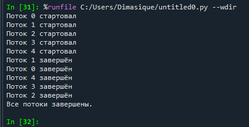

Не совсем понял задание, в нем не указано требование многопоточности по формулировке, но тогда в питоне это было бы 5 строк. 
Сразу реализовал небольшой скрипт с тредами:

import threading
import time

def worker(thread_id):
    print(f"Поток {thread_id} стартовал")
time.sleep(2)  
    print(f"Поток {thread_id} завершён")

threads = []
for i in range(5):
thread = threading.Thread(target=worker, args=(i,))
threads.append(thread)
    thread.start()  
for thread in threads:
    thread.join()
print("Все потоки завершены.")

После выполнения получаем вывод:

Потоки запускаются почти в одно время и в итоге выходят из "спячки" почти в одно время, что и разбрасывает их не по порядку.