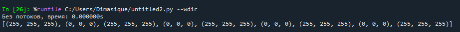
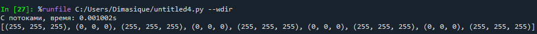
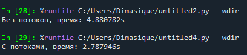

1. Проверим работу скипта на маленькой доске и убедимся в правильности кода:

2. Аналогично для второго скрипта:

3. Замерим работу для массива 2000 на 2000 (и не забудем выключить вывод результата=/):

Вывод: Не смотря на проблемы с GIL, все еще можно добиться ускорения работы скрипта почти в два раза для больших массивов данных.
Если бы вычисления были тяжелее, то можно было бы перейти на multiprocessing. При его использовании в таком кейсе мы потратим больше
ресурсов на созданию и изоляцию потоков со своими интерпретаторами.